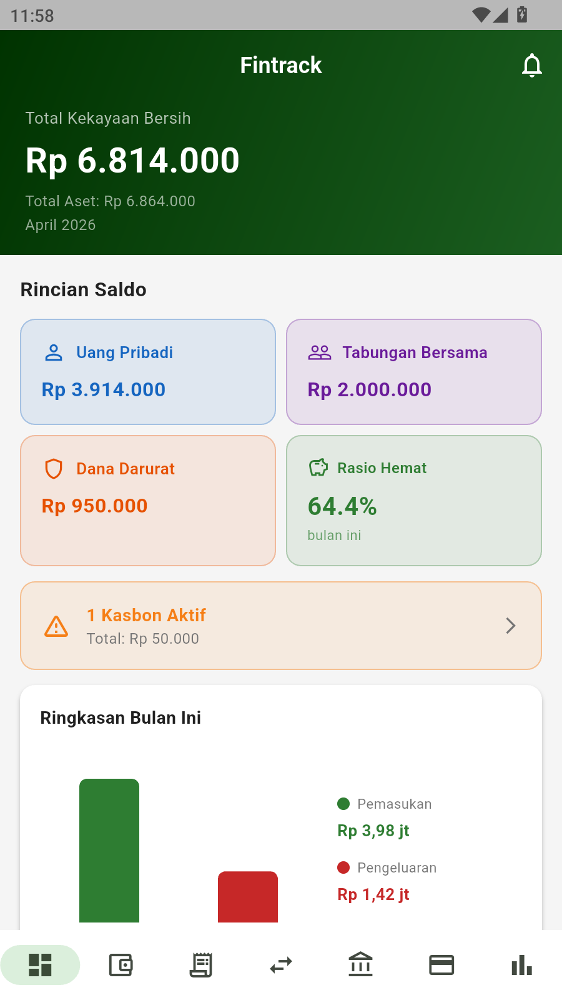
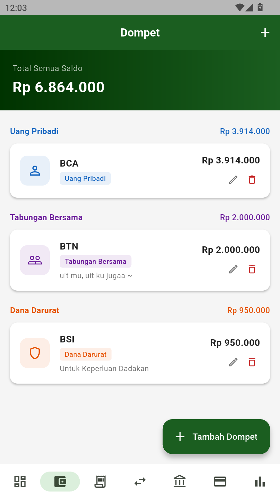
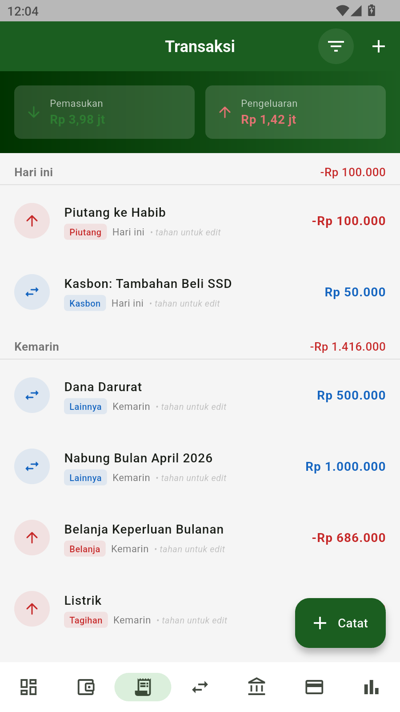
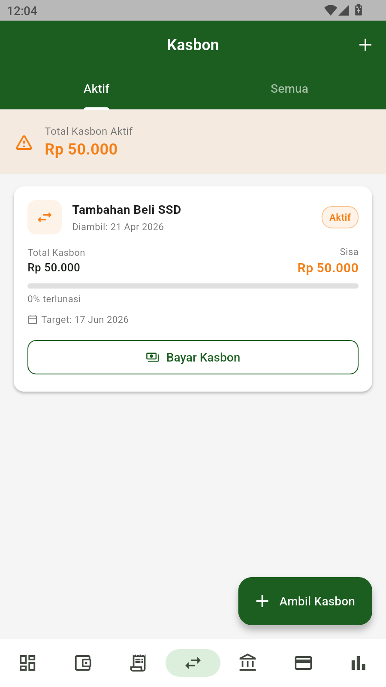
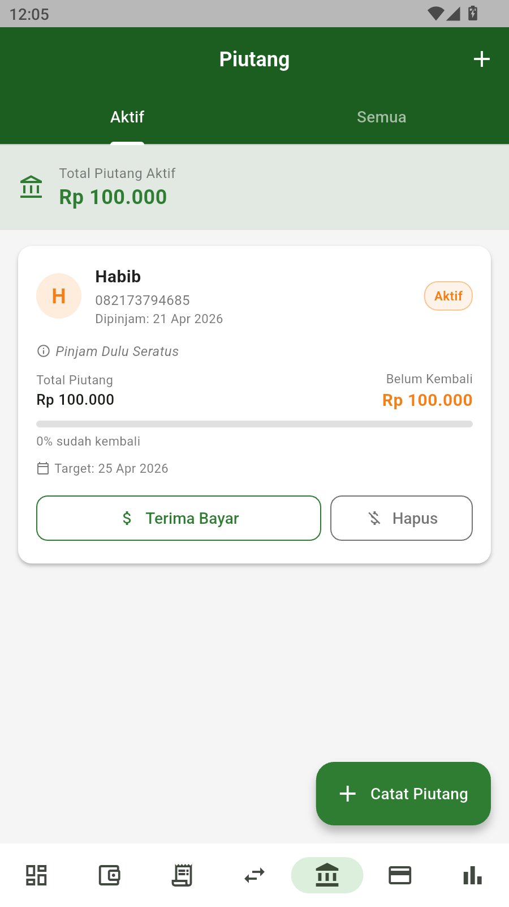
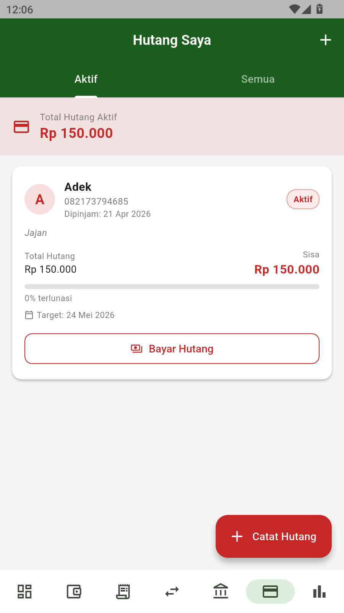
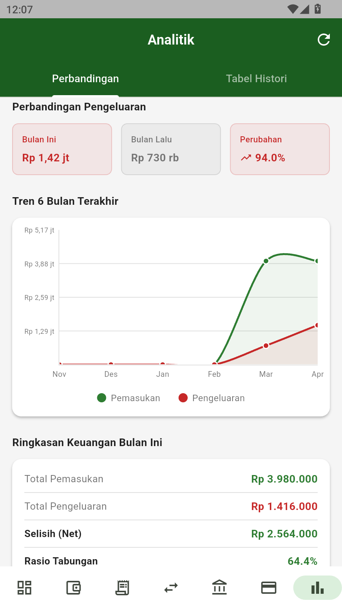

# 💰 Fintrack — Personal & Shared Finance Manager

<p align="center">
  
</p>

<p align="center">
  
  
  
  
  
</p>

> Aplikasi monitoring keuangan pribadi dan bersama yang lengkap — kelola dompet, catat transaksi, pantau kasbon, piutang, dan hutang dalam satu aplikasi.

---

## 📱 Screenshots

| Dashboard | Dompet | Transaksi | Kasbon | Piutang | Hutang | Analitik |
|:---------:|:------:|:---------:|:------:|:-------:|:------:|:--------:|
|  |  |  |  |  |  |  |

---

## ✨ Fitur Utama

### 🏦 Manajemen Dompet
- Kelola multiple dompet/rekening dalam satu tempat
- 3 kategori utama: **Uang Pribadi**, **Tabungan Bersama**, **Dana Darurat**
- Saldo real-time yang update otomatis setiap transaksi
- Detail wallet dengan histori transaksi per dompet

### 💸 Pencatatan Transaksi
- Catat **Pemasukan**, **Pengeluaran**, dan **Transfer** antar dompet
- 15+ kategori transaksi (Makanan, Transport, Tagihan, Gaji, dll)
- Filter transaksi berdasarkan tipe dan rentang tanggal
- Edit dan hapus transaksi dengan reverse saldo otomatis
- Histori transaksi dikelompokkan per tanggal

### 🔄 Sistem Kasbon (Hutang Internal)
- Pinjam dana sementara dari **Tabungan Bersama** atau **Dana Darurat** ke **Uang Pribadi**
- Pemindahan saldo otomatis antar dompet
- Progress bar pelunasan
- Bayar kasbon sebagian atau lunas sekaligus

### 📋 Piutang (Uang Dipinjamkan)
- Catat uang yang dipinjamkan ke orang lain beserta nama & kontak
- Terima pembayaran sebagian atau lunas
- Write-off piutang yang tidak bisa ditagih
- Progress tracker pengembalian

### 💳 Hutang ke Orang Lain
- Catat hutang kepada siapa saja
- Track sisa hutang yang harus dibayar
- Bayar hutang dari dompet manapun
- Progress pelunasan

### 📊 Dashboard & Analitik
- Total kekayaan bersih real-time
- Ringkasan saldo per kategori dompet
- Banner kasbon aktif dengan total hutang internal
- Chart pemasukan vs pengeluaran bulan ini
- Tren keuangan 6 bulan terakhir (Line Chart)
- Perbandingan pengeluaran bulan ini vs bulan lalu
- Rasio tabungan dengan saran keuangan
- Tabel histori pengeluaran per kategori

### 🎨 UX & Desain
- Splash screen animasi dengan efek lingkaran dan bounce logo
- Onboarding 4 halaman untuk pengguna baru
- Navigasi swipe kiri/kanan antar halaman dari tepi layar
- Bottom navigation adaptif (icon only di HP kecil)
- Versi app otomatis dari pubspec.yaml

---

## 🛠️ Tech Stack

| Layer | Teknologi |
|-------|-----------|
| **Framework** | Flutter 3.41+ |
| **Language** | Dart 3.11+ |
| **Database** | Drift (SQLite) |
| **State Management** | Riverpod 2.x |
| **Navigation** | GoRouter |
| **Charts** | FL Chart |
| **Local Storage** | Shared Preferences |
| **Code Generation** | build_runner, freezed |

---

## 📁 Arsitektur Project

    lib/
    ├── core/
    │   ├── constants/       # Warna, string, dimensi
    │   ├── database/        # Drift database & migrations
    │   ├── errors/          # Custom exceptions
    │   └── utils/           # Helper functions
    ├── models/              # Drift table definitions
    ├── repositories/        # Data access layer + business logic
    ├── providers/           # Riverpod state management
    └── features/
        ├── splash/          # Splash screen dengan animasi
        ├── onboarding/      # Onboarding 4 halaman
        ├── dashboard/       # Halaman utama
        ├── wallets/         # Manajemen dompet
        ├── transactions/    # Pencatatan transaksi
        ├── internal_debt/   # Kasbon
        ├── receivables/     # Piutang
        ├── debts/           # Hutang ke orang lain
        └── analytics/       # Laporan & analitik

---

## 🚀 Cara Install & Menjalankan

### Prerequisites

- Flutter SDK >= 3.22.0
- Dart SDK >= 3.4.0
- Android Studio / VS Code
- Android SDK (untuk Android)

### Clone & Setup

    git clone https://github.com/username/fintrack.git
    cd fintrack
    flutter pub get
    dart run build_runner build --delete-conflicting-outputs
    flutter run

### Build Release APK

    flutter build apk --release

File APK tersimpan di:

    build/app/outputs/flutter-apk/app-release.apk

---

## 🗄️ Database Schema

| Tabel | Keterangan |
|-------|-----------|
| Wallets | Dompet/rekening pengguna |
| Transactions | Semua transaksi (income/expense/transfer) |
| InternalDebts | Kasbon — hutang internal antar dompet |
| Receivables | Piutang — uang dipinjamkan ke orang lain |
| Debts | Hutang pengguna ke orang lain |

---

## 📋 Logika Bisnis Utama

### Kasbon Flow

    User ambil kasbon Rp 500.000
    ├── Tabungan Bersama  : -Rp 500.000
    ├── Uang Pribadi      : +Rp 500.000
    └── InternalDebt      : remainingAmount = 500.000 (active)

    User bayar kasbon Rp 200.000
    ├── Uang Pribadi      : -Rp 200.000
    ├── Tabungan Bersama  : +Rp 200.000
    └── InternalDebt      : remainingAmount = 300.000 (partiallyPaid)

### Hapus Transaksi

    Expense dihapus  → saldo wallet source dikembalikan (+)
    Income dihapus   → saldo wallet target dikurangi (-)
    Transfer dihapus → kedua wallet di-reverse

---

## 🤝 Kontribusi

Pull request sangat disambut! Untuk perubahan besar, silakan buka issue terlebih dahulu.

1. Fork repository
2. Buat branch fitur `git checkout -b feature/NamaFitur`
3. Commit perubahan `git commit -m 'Add: NamaFitur'`
4. Push ke branch `git push origin feature/NamaFitur`
5. Buat Pull Request

---

## 📄 Lisensi

```
Copyright 2026 Fintrack

Licensed under the Apache License, Version 2.0 (the "License");
you may not use this file except in compliance with the License.
You may obtain a copy of the License at

    http://www.apache.org/licenses/LICENSE-2.0

Unless required by applicable law or agreed to in writing, software
distributed under the License is distributed on an "AS IS" BASIS,
WITHOUT WARRANTIES OR CONDITIONS OF ANY KIND, either express or implied.
See the License for the specific language governing permissions and
limitations under the License.
```

---

<p align="center">Made with ❤️ using Flutter</p>
